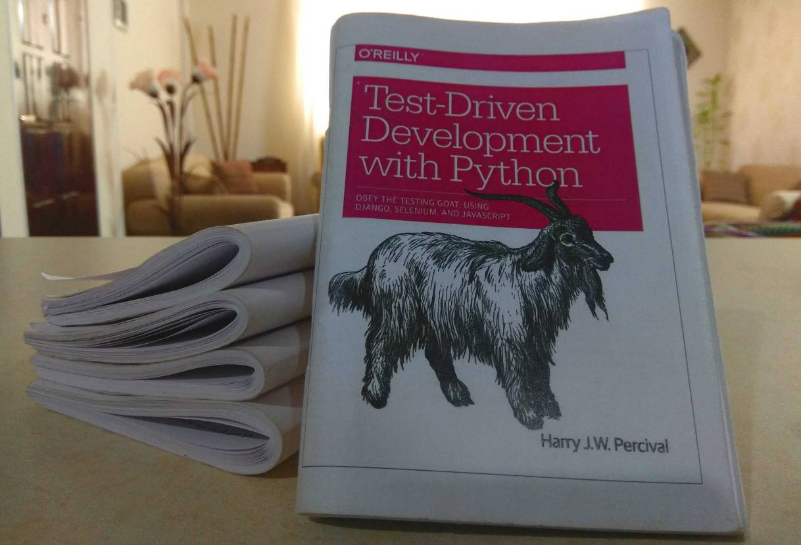
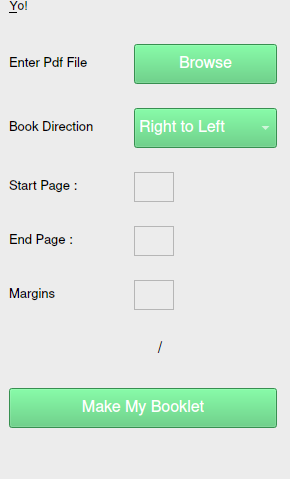

# bookleter
##### Turns pdfs into a6 sized foldable booklets



<h2 dir="rtl">
  
[روش نصب ، استفاده ، چاپ و اطلاعات بیشتر](https://virgool.io/@mohsenbarzegar/bookleter-nkkuh18xnbyk)</br>

</h2>

## install
```console
$ pip install bookleter
```

## usage
```console
$ bookleter [pdfname] [start_page-end_page] [direction: rtl ltr] [page crop: '50 50 50 50']
```
direction: right to left (rtl) or left to right (ltr)

page crop: amount of page border crop in pixels 'left top right bottom'

### example command
```console
$ bookleter my_book.pdf 1-30 rtl '50 50 50 50'
```

## start GUI
```console
$ bookleter
```



